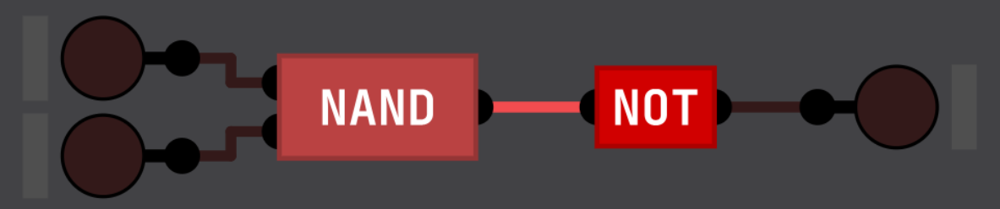
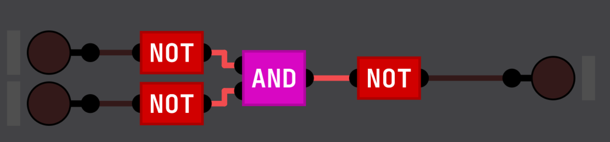
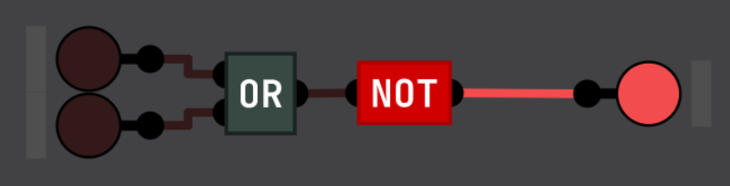
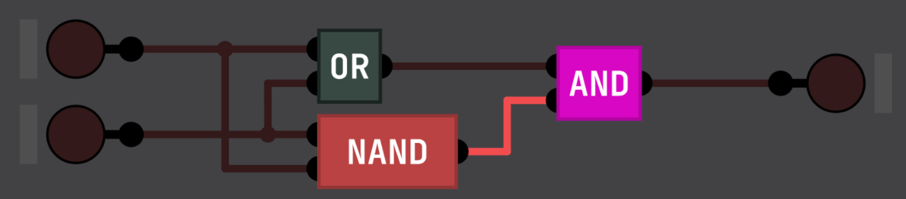
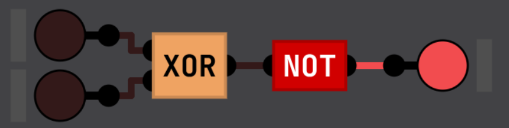

# The Logic gates

The logic gates are the core of all the computers. If there are no logic gates, there are no computers. The logic gates 
take one or two input and as one input. They behavior can be listed in a table of truth.
Here is the list of all the logic gates :

 - NAND
 - NOT
 - AND
 - OR
 - NOR
 - XOR
 - XNOR

---

But NAND is special, because he makes all the other logic gates.
Here is it's table of truth

| A | B | A NAND B |
|---|---|----------|
| 0 | 0 | 1        |
| 1 | 0 | 1        |
| 0 | 1 | 1        |
| 1 | 1 | 0        |

---

Now, what is the next logic gate ? And how can we make it with a NAND ?
Well the next gate is the NOT gate. His truth table is the following :

| A | NOT |
|---|-----|
| 0 | 1   |
| 1 | 0   |

As you can see, it only has 1 input, and it invert it, how do we build this gate with an NAND gate ?

The N in NAND stand for NOT, the following gates with an N also means NOT, it is just an inverted version of the other gate.
Now that we know that, we can build it with a NAND gate by connecting the 2 input of a NAND gate with only 1 input. Like
this :

We can see that in the truth table, when the 2 input are 0, the output is 1 and if the 2 input are 1, the output is 0.
This mean that if A is a 0, the output will be a 1, and if A is a 1, the output will be a 0, following our truth table !

---

Now with these 2 gates, we can build an AND gate which as the following truth table :

| A | B | A AND B |
|---|---|---------|
| 0 | 0 | 0       |
| 1 | 0 | 0       |
| 0 | 1 | 0       |
| 1 | 1 | 1       |

This gate only output a 1 if both A **and** B is a 1. To creating this gate is simple. You may noticed that the AND gate
is an inverted NAND gate. To invert we only have to use a NOT like this :

---

The next gate is an OR gate. An OR gate output a 1 if one or both is input are a 1. Like this :

| A | B | A OR B |
|---|---|--------|
| 0 | 0 | 0      |
| 1 | 0 | 1      |
| 0 | 1 | 1      |
| 1 | 1 | 1      |

To do this gate, we will use a law, De Morgan's laws.

This law can be expressed in English as:

- The negation of "A AND B" is the same as "NOT A OR NOT B".
- The negation of "A OR B" is the same as "NOT A AND NOT B".

So to get an OR we need 3 NOT and 1 AND gate. It's build like that :

---

Now, we are going to build the NOR gate. This gate is an inverted OR gate.

| A | B | A NOR B |
|---|---|---------|
| 0 | 0 | 1       |
| 1 | 0 | 0       |
| 0 | 1 | 0       |
| 1 | 1 | 0       |

Like we did previously, we will just use a NOT gate like this :

---

The XOR gate is a complicated gate. It takes 2 input, and output a 1 if ONLY 1 of the input is a 1. If both are ones, 
he output a 0.

| A | B | A XOR B |
|---|---|---------|
| 0 | 0 | 0       |
| 1 | 0 | 1       |
| 0 | 1 | 1       |
| 1 | 1 | 0       |

To do that we will only use 3 gates. An OR gate to detect if or both of the input are 1. An NAND gate to turn off when
both of the input are 1. And finally an AND gate to join them. Both input goes in the OR and the NAND gate, then the 
output of the 2 gates goes in the AND gate. When wired up in the simulation, it should look like this :

---

Finally, the XNOR gate, like all the gates with a N, all we have to do is add a not at the end. Because the output are 
just inverted in the truth table that you can see below.

| A | B | A XNOR B |
|---|---|----------|
| 0 | 0 | 1        |
| 1 | 0 | 0        |
| 0 | 1 | 0        |
| 1 | 1 | 1        |

